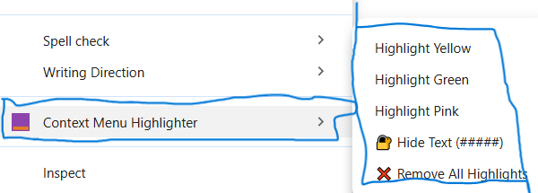

# 🖍️ Text Highlighter & Hider Chrome Extension

A simple yet powerful Chrome extension that lets you **highlight** or **hide** any selected text on a webpage with just a right-click.

---

## ✨ Features

✅ Highlight selected text in:
- 🟡 Yellow  
- 🟢 Green  
- 🌸 Pink  

✅ Hide selected text with `#####` style (same number of hashes as characters)  
✅ Enable/Disable Active Mode from the popup  
✅ Remove all highlights from the page  
✅ Lightweight, fast, and clean UI  

---

## 🖼️ Screenshots

| Popup UI | Context Menu |
|----------|--------------|
|  |  |

---

## 📦 Installation

1. Clone or download this repository  
   ```bash
   git clone https://github.com/your-username/text-highlighter-extension.git

2. Open Chrome and go to chrome://extensions

3. Enable Developer mode (top right)

4. Click "Load unpacked" and select the extension folder

Done! 🎉

🧠 Usage
. Select any text on any webpage

. Right-click and choose a color to highlight or choose "🔐 Hide Text (#####)" to mask it

. Use the popup to enable/disable active mode or remove all highlights

. Highlights stay unless removed manually (session-based)

📁 File Structure
```bash
text-highlighter-extension/
│
├── icons/               # Extension icons
│   └── icon16.png, ...
│
├── popup.html           # Popup interface
├── popup.css            # Popup styling
├── popup.js             # Popup logic
│
├── background.js        # Context menu logic
├── content.js           # Highlight/hide logic on pages
├── manifest.json        # Extension configuration
└── README.md
```
---
🛠️ Built With
JavaScript

Chrome Extensions API (Manifest v3)

HTML + CSS
---
📜 License

MIT License ©sukantahirock

🌐 Author

Sukanta Nag Hirock
